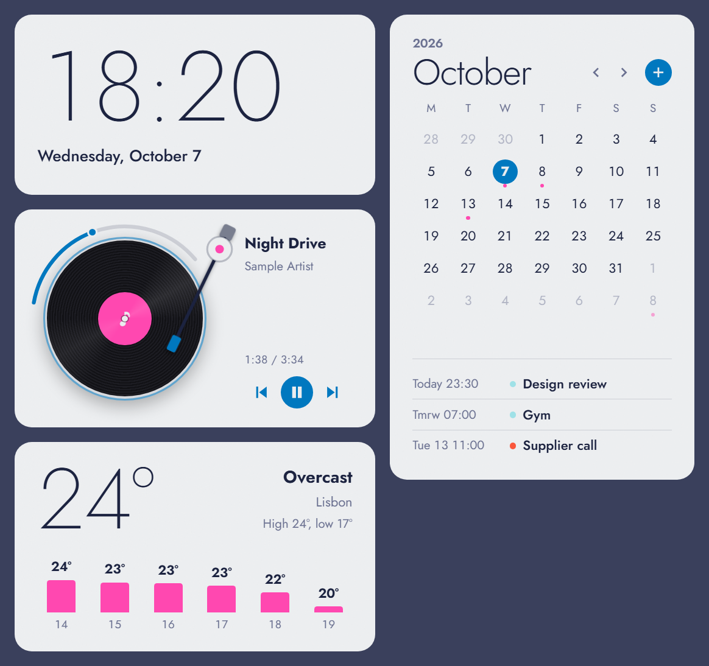

# Desk Widgets

Desktop widgets for Windows: an analog world clock, now playing, weather, and Google Calendar, themed from your wallpaper.



## Download

**[⬇ Download the latest version](https://github.com/sevensixteeeen/desk-widgets/releases/latest)**. Under **Assets**, pick the file ending in `x64-setup.exe` (about 3 MB).

1. Run the installer. Windows shows **"Windows protected your PC"** because the app isn't code-signed; click **More info → Run anyway**.
2. Open **Desk Widgets** from the Start menu. The widgets appear on your desktop, behind your other windows.
3. Optional: right-click the tray icon and tick **Open at login**.

**Needs:** 64-bit Windows 10 or 11. Nothing else to install.

**Works right away:** clock, now playing and weather (type your city once). The **calendar** needs a one-time Google setup, described [below](#connect-google-calendar-optional).

**Uninstall:** Settings → Apps → Installed apps → Desk Widgets.

## Features

- **Clock:** a dial for your time and any cities or countries you add, light by day and dark by night, with how far ahead or behind each one is. The default 24-hour face shows each city's weather by day (sun, cloud, rain...) and tonight's moon, in its real phase, at night. Five other faces to choose from in `config.js`.
- **Now playing:** a turntable for whatever is playing in Spotify, YouTube in Chrome, or any app that reports media to Windows. The record spins while music plays, the album cover is its centre label, and the tonearm moves inward as the song goes on. Shows whether it's playing from Spotify or YouTube, and the full song name. Play/pause/skip, and click or drag the arc around the record to jump anywhere in the song (in apps that let Windows control playback position). No Spotify login needed.
- **Weather:** current conditions and the next 6 hours, from [Open-Meteo](https://open-meteo.com) (no API key).
- **Calendar:** month view (browse with ‹ › or the mouse wheel) with events from every calendar ticked in your Google Calendar. The list under it follows the month on screen: upcoming events for this month, that month's events when you browse to another. Click a day or **+** to add an event to whichever calendar you choose.
- **Themed from your wallpaper:** colours are pulled from your current wallpaper and update when you change it.
- **Stays on the desktop:** behind your apps, and still visible after Win+D.
- **Resizable:** make any widget bigger or smaller; each one remembers its size.
- **Tray menu:** Show widgets (hide the ones you don't want), Lock widgets (stops accidental dragging), Open at login, Quit.
- **Ctrl+Alt+L** locks/unlocks the widgets from anywhere.

## Using it

- **Move a widget:** drag it. Positions are remembered.
- **Resize a widget:** drag the small grip in its bottom-right corner (it appears when you point at the widget), or hold **Ctrl** and scroll the mouse wheel over it. Double-click the grip to go back to the default size.
- **Lock them in place:** tray → **Lock widgets**, or **Ctrl+Alt+L** from anywhere.
- **Hide a widget:** tray → **Show widgets** → untick it.
- **Jump to a point in the song:** click or drag the arc around the record.
- **Change the weather city:** click the city name.
- **Add a clock for another country:** click **+** on the clock and type a city or country (e.g. Tokyo, Dubai, Japan). Point at a clock and click **×** to remove it.
- **Quit:** tray → **Quit widgets**.

## Connect Google Calendar (optional)

The app needs your **own** Google OAuth client. None is included in this repo.

1. In [Google Cloud Console](https://console.cloud.google.com), create a project and enable the **Google Calendar API**.
2. In **Google Auth Platform**, set the audience to **External** and add yourself as a test user.
3. Under **Data Access**, add the scopes `calendar.readonly` and `calendar.events`.
4. Under **Clients**, create a **Desktop app** client and download its JSON.
5. Save it as `%APPDATA%\com.deskwidgets.app\google_client.json`.
6. Click **Connect Google Calendar** in the widget.

To stay signed in for more than 7 days, publish the app from the **Audience** page. This needs a home page and a privacy policy on the **Branding** page. Don't upload a logo, because that triggers Google's verification review.

## Your data

Everything stays on your PC. The Google client file and sign-in token live in `%APPDATA%\com.deskwidgets.app\` and are never part of this repo. Calendar events go straight between your PC and Google. The weather widget sends only the city name you type to Open-Meteo.

## For developers

### Project map

```
src/                   Frontend (plain HTML/CSS/JS, no bundler)
  config.js            Your settings: size, 12/24h, week start, °C/°F, clock face, now-playing style
  main.js              Picks the widget for each window; size, drag and lock
  resize.js            Resize grip and Ctrl + wheel; remembers each widget's size
  theme.js             Turns the wallpaper into a colour palette
  api.js               Talks to Rust, or returns sample data in a normal browser
  styles.css           Design system and all widget styles
  widgets/*.js         One file per widget
src-tauri/
  tauri.conf.json      The 4 windows: start position, frameless, pinned to desktop
  src/lib.rs           Commands exposed to JS, tray menu, plugins, Win+D fix
  src/media.rs         Now playing (Windows media session API)
  src/gcal.rs          Google sign-in, reading and adding events
  src/wallpaper.rs     Reads and shrinks the current wallpaper
  src/settings.rs      Saved settings (lock, hidden widgets)
```

### Build from source

Only needed to change the code. To just use the app, see [Download](#download).

**Prerequisites:** [Visual Studio Build Tools](https://visualstudio.microsoft.com/visual-cpp-build-tools/) with "Desktop development with C++", [Rust](https://rustup.rs), and Node.js LTS.

```
npm install
npm run tauri dev      # run in development
npm run tauri build    # make an installer in src-tauri/target/release/bundle/
```
